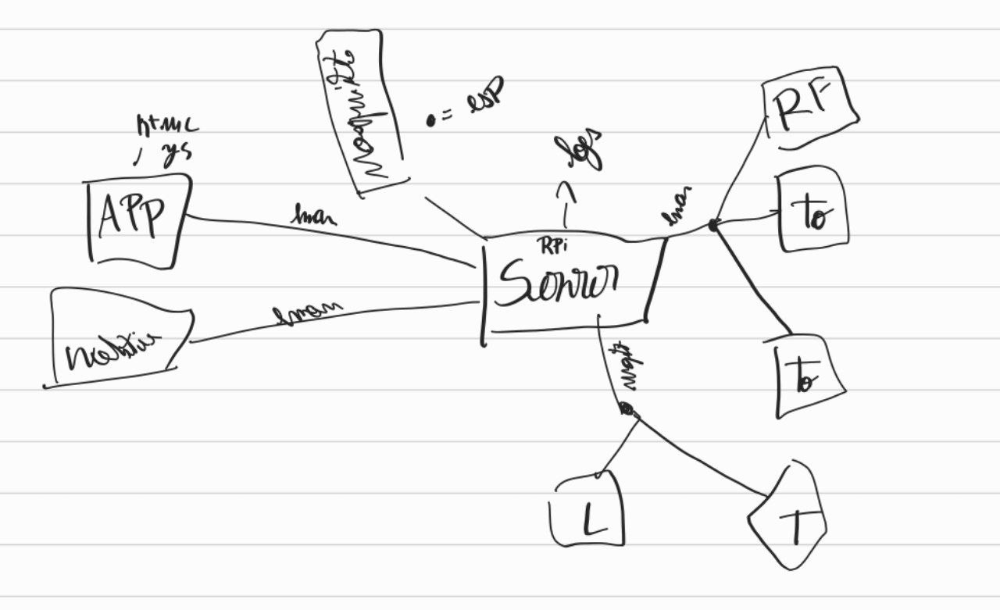

# Laboratório IOT

## Ideia do Projeto 
Casa Inteligente

- Tomada 1: Tomada com o aquecedor
- Tomada 2: Tomada com a luz

### Especificidades:
- Servidor:
    - O servidor decide se deve ligar as tomadas com base na temperatura
    - O servidor tem a responsabilidade de mandar todos os dados para o EmonCMS
    - O servidor tem a responsabilidade de manter logs de tudo o que acontece
- 1º ESP:
    - O ESP tem a responsabilidade de enviar os dados de temperatura e luminosidade para o servidor através de MQTT
- 2º ESP:
    - O ESP tem a responsabilidade de receber os dados do servidor através de MQTT e ligar ou desligar as tomadas com base nesses dados
- Android APP:
    - O APP tem a responsabilidade de mostrar os dados de temperatura e luminosidade
    - O APP tem a responsabilidade de mostrar o estado das tomadas
    - O APP tem a responsabilidade de ligar ou desligar as tomadas
    - O App tem a opção de ligar ou desligar o modo automático (o servidor decide se deve ligar ou desligar as tomadas com base na temperatura)

## Requisitos
- 2x ESP8266
- 1x Sensor de Temperatura
- 1x Sensor de Luminosidade
- 1x Transmissor de radiofrequência
- 1x Raspberry Pi
    - 1x Servidor MQTT (Mosquitto)
    - 1x NodeJS
    - 1x Servidor Web (NodeJS) 
- 1x Android APP
- 1x EmonCMS
- 2x Tomadas
- 2x Relés

## Estrutura do Projeto
- 1x ESP8266
    - 1x Sensor de Temperatura
    - 1x Sensor de Luminosidade
- 1x ESP8266
    - 1x Transmissor de radiofrequência
    - 2x Tomadas

## Mosquitto:
Tópicos MQTT:
- Get data:
    - `sensor/temperatura`
    - `sensor/lux`
    - `sensor/humidade`
- Decisions
    - `tomadas`
        - expected payload: `{"id": 1, "estado": 1}`
            - `id`: numero da tomada
            - `estado`: 0 ou 1
    - `modo` 
        - Modo automático
        - expected payload: `{"modo": 1}`
            - `modo`: 0 ou 1
    - `log`
        - expected payload: `{"type": "log", "by": "device", "message": "mensagem de log"}`
            - `type`: log ou error
                - possíveis valores: `["trace", "debug", "info", "warn", "error", "fatal"]`
            - `by`: quem gerou o log
                - possíveis valores: `["ESP1", "ESP2", "SERVER", "APP"]`
            - `message`: mensagem de log

    
## Conexões
### First ESP
- DHT22
    - GDOUT -> D1 (GPIO5)
    - VCC -> 3V3
    - GND -> GND
- GY-30
    - GND -> GND
    - ADO -> nenhum
    - SDA -> D2 (GPIO4)
    - SCL -> D3 (GPIO0)
    - VCC -> 3V3

### Second ESP
- 3x Tomada (RSL-3660R)
- 1x Sensor de RF: (XD-FST)
    - VCC -> 3.3V
    - GND -> GND
    - DATA -> D4 (GPIO2)

## APP 
- [Android APP](./APP/README.md)
## Servidor
- [Servidor](./server/README.md)

## Estrutura do Projeto
